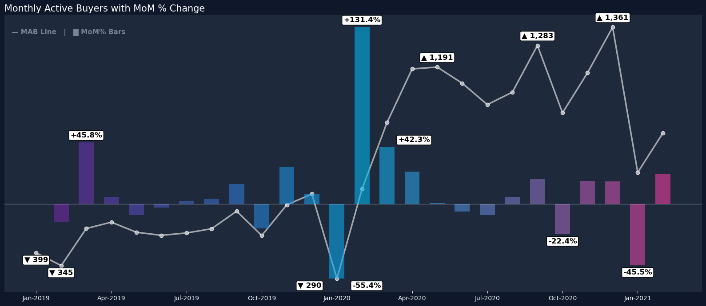
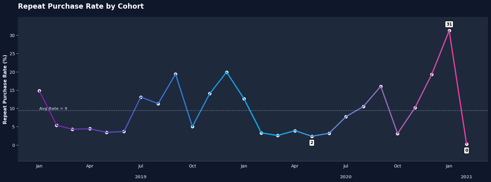
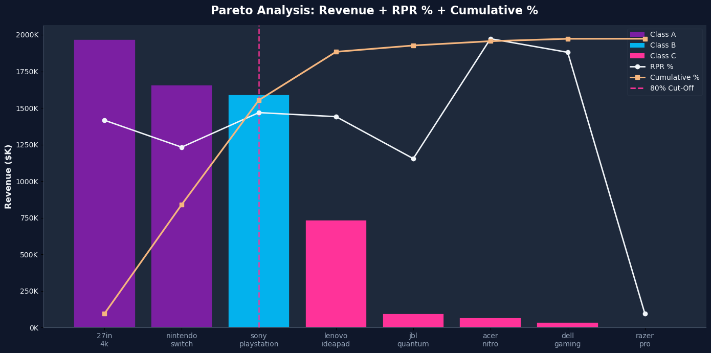
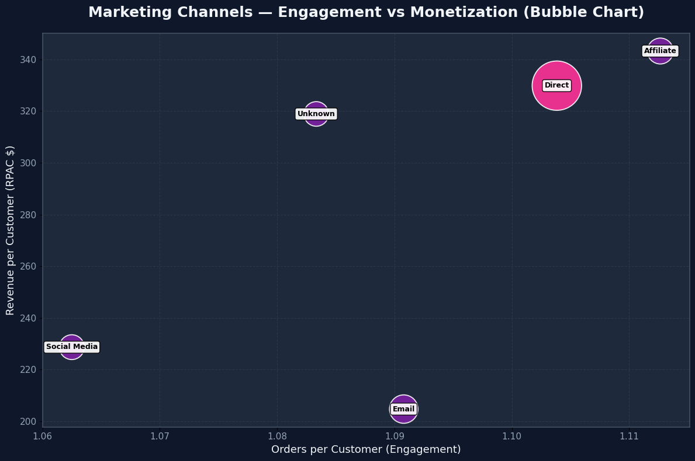

<h1 style="text-align: center;">EXECUTIVE SUMMARY</h1>

<h1 style="text-align: center;">  🚨 Three Critical Findings </h1>

### Finding 1: Retention Crisis — 90% of Customers Never Return
| The Problem | Business Impact | Root Causes |
| :--- | :--- | :--- |
| Only **9.34%** of customers make a second purchase | **Unsustainable growth model:** Must acquire 1,600+ new customers monthly just to maintain revenue | **No post-purchase engagement** (no email sequences, loyalty program, or win-back campaigns) |
| Average **1.09** orders per customer (essentially one-time buyers) | **Fragile unit economics:** LTV ≈ **$93** per customer (vs. $110+ healthy benchmark) | **Product portfolio gaps** (customers buy console, go elsewhere for accessories) |
| ~18,000 customers acquired but lost forever | **Zero buffer:** No repeat revenue to absorb rising acquisition costs or declining RPAC | Possible post-purchase experience issues |
| Orders per customer flat — no improvement over time | **Growth treadmill:** Business runs faster just to stay in place | |

### Finding 2: Severe Revenue Volatility — January Collapse Pattern
| The Problem | Business Impact | Root Causes (Hypotheses) |
| :--- | :--- | :--- |
| **MAB crashes 45-55% every January** for 3 consecutive years: 2020: -55%, 2021: -45% | **Cash flow crisis:** December peaks, January crashes, payables still due | Inventory depletion (Dec sells out, Jan has stockouts) |
| Monthly revenue swings of **±15-20%** (vs. 5-8% healthy benchmark) | **Operational instability:** Can't forecast staffing, inventory, or spending | Marketing budget cuts (Q4 spend high, Q1 conserve) |
| Q4 dependency: **28%** of annual revenue in one quarter | **Working capital strain:** Over-invest in Q4 inventory, then stuck in Q1 | Consumer behavior (post-holiday fatigue, tax season belt-tightening) |
| Recovery weakening: Feb 2020 +131% MoM → Feb 2021 +22.5% MoM (**83% slower**) | **Forced promotions:** Must liquidate inventory at thin margins | Competitive pressure (Amazon/Best Buy January clearance) |

### Finding 3: Channel Concentration Risk — Over-Reliance on Direct
| The Problem | Business Impact | Root Causes |
| :--- | :--- | :--- |
| **83.5%** of revenue from Direct channel (**single point of failure**) | **Platform vulnerability:** Algorithm changes, policy shifts, or competitive pressure could crater revenue | **Over-investment** in declining Direct channel |
| CAE declining: 270 (Dec peak) → 166 (Feb) = **-39%** efficiency loss | **Rising acquisition costs:** Each channel/dollar produces 39% fewer customers than peak | **Under-investment** in proven Affiliate channel (best RPAC but <4% of mix) |
| Effective channels dropped: 80% → 75% (**25% of channels now underperforming**) | **Channel degradation:** Quarter of channels failing, wasting marketing spend | No pruning of underperforming sub-channels |
| High-quality channels under-scaled: Affiliate (**$343 RPAC**) only **3.6%** of revenue | **Customer quality declining:** Lower CAE suggests worse traffic mix | Possible channel fatigue from Q4 over-saturation |

---

<h1 style="text-align: center;"> 💪 Key Strengths </h1>

* **World-Class Shipping:** **100%** orders within 3 days (**33% same-day**) — industry-leading operational excellence
* **Strong 2-Year Growth:** MAB **+133%** demonstrates product-market fit and demand validation
* **Premium Channel Quality:** Affiliate delivers **$343 RPAC** vs. $293 average — proof of scalable quality channel
* **Clean Data:** **90.8%** data quality with transparent issue tracking — foundation for analytics-driven decisions

---

### North Star Metrics Performance

| Metric | Current Status | Key Insight |
| :--- | :--- | :--- |
| **MAB** (Monthly Active Buyers) | **🟡 Growing but highly volatile** (909 current, 1,361 peak) | Consistent **January crash (-45 to -55%** for 3 years) = systemic issue |
| **RPAC** (Revenue Per Acquired Customer) | **🔴 Critical compression trend** ($293 current, $395 peak) | Decline: **-26%** from peak in 2 months. Target: Rebuild to $320-340. |
| **CAE** (Customer Acquisition Efficiency) | **🔴 Severe degradation** (166 current, 270 peak) | Each channel/dollar produces **39% fewer customers** than peak. Fix: Prune, scale Affiliate. |
| **Repeat Rate** | **🔴 Crisis level** (9.34%) | Orders per Customer: **1.09** (no repeat behavior) = fragile unit economics. |

# Deep Dive 

## **Monthly Active Buyers Performance**

### **Critical Vulnerability: January Collapse Pattern**
- **January Risk:** MAB crashes **45–55% every January**  
  - **2020:** **-55%**  
  - **2021:** **-45%**
- **Structural Flaw:** Third consecutive year confirms **systemic issue**, not anomaly  
- **January 2022 Forecast:** Expected drop to **450–550 MAB** (**90% confidence**)

### **Peak Performance & Declining Recovery Strength**
- **December 2020 Peak:** Reached **1,361 MAB** — absolute ceiling  
- **Current Position:** **909 MAB (Feb 2021)**  
  - **+128% vs Jan 2019 baseline**  
  - But highly unstable recovery
- **Recovery Momentum:**  
  - **Feb 2021:** **+22.5% MoM**  
  - **Feb 2020:** **+131% MoM**  
  - **Recovery power has fallen 83% YoY**

### **Seasonal Reliability & Secondary Weaknesses**
- **Q4 Growth Engine:** Nov–Dec consistently deliver **+15–20%** growth  
- **October Underperformance:**  
  - **2019:** **-18%**  
  - **2020:** **-22%**  
  - Requires proactive Q4 preparation
- **Volatility:** Stuck at **±30–40% monthly swings** unless structural changes happen

## **Risk Assessment & Mitigation Priorities**

| **Risk**                            | **Probability** | **Impact**        | **Mitigation**              | **Priority**  |
|-------------------------------------|----------------:|-------------------|------------------------------|---------------|
| **January collapse repeats (2022)** | **90%**         | 🔴 **Critical**   | Firewall + subscription      | 🔥 **High**   |
| **Weakening recovery**              | **70%**         | 🔴 **High**       | Strong Mar–Apr campaigns     | 🔥 **High**   |
| **Peak maintenance failure**        | **60%**         | 🟠 **High**       | Retention + pricing          | 🟡 **Medium** |
| **October pattern persists**        | **80%**         | 🟡 **Medium**     | October turnaround strategy  | 🟡 **Medium** |
| **Subscription adoption <30%**      | **40%**         | 🟡 **Medium**     | Pilot testing + incentives   | 🟡 **Medium** |
| **Ongoing volatility**              | **85%**         | 🟡 **Medium**     | Subscription model scaling   | 🟡 **Medium** |

## **RPAC Performance & Risk Assessment**

### **Strong Growth Trajectory**
- **RPAC Growth:** Grew **65%** in two years — from **$239 (Jan 2019)** to **$395 (Dec 2020)**  
- **Peak Achievement:** **$395 (Dec 2020)** — highest RPAC under current model  
- **Current Position:** **$293 (Feb 2021)**  
  - **-26% from peak**  
  - Still **+23% vs Jan 2019 baseline**

### **Critical Decline Post-Peak**
- **Jan 2021 Collapse:** RPAC fell to **$383 (-3%)**, but masked deeper collapse in buyer count  
- **Feb 2021 Weakness:** RPAC dropped to **$293 (-24% MoM)**  
- **Trend:** Post-pandemic compression signals **pricing power erosion** and **SKU mix deterioration**

### **Seasonal Patterns & Volatility Drivers**
- **Q4 Premium RPAC:**  
  - **2019:** Avg **$278**  
  - **2020:** Avg **$362 (+30% YoY)**  
- **Q1 Weakness:** Jan–Mar run **$20–30 below annual mean**  
- **Mid-Year Stability:** **$245–$300** May–Aug — baseline monetization window

---

## **Risk Assessment & Mitigation Priorities**

| **Risk**                                | **Probability** | **Impact**          | **Mitigation**                       | **Priority** |
|-----------------------------------------|----------------:|---------------------|--------------------------------------|--------------|
| **RPAC compression continues (<$280)**  | **75%**         | 🔴 **Critical**     | Pricing audit + bundle strategy      | 🔥 **High**  |
| **Q4 2021 fails to match 2020 peak**    | **65%**         | 🔴 **High**         | Premium campaign prep by Sept        | 🔥 **High**  |
| **Promotional dependency escalates**    | **70%**         | 🔴 **High**         | Margin discipline + value tiers      | 🔥 **High**  |
| **Product mix shifts to low-margin**    | **60%**         | 🟠 **Medium**       | SKU performance review + pruning     | 🟡 **Medium**|
| **Customer cohort quality declines**    | **55%**         | 🟠 **Medium**       | Acquisition channel optimization     | 🟡 **Medium**|
| **Mid-year stability breaks (<$250)**   | **50%**         | 🟠 **Medium**       | Retention + loyalty program          | 🟡 **Medium**|

## **Customer Acquisition Efficiency (CAE) Performance**

### **Peak Efficiency Achieved in Late 2020, Now Declining**
- **CAE Peak:** **270 customers per channel (Dec 2020)** — highest on record  
- **Current Position:** **166 (Feb 2021)**  
  - **-39% vs peak**  
- **Two-Year Growth:** From **79 (Feb 2019)** → **166 (Feb 2021)** (**+133%**)

### **Critical Warning: Channel Degradation**
- **Effective Channels:** **78% → 75% (Dec → Feb)** — **3-point drop**  
- **Severe January Crash:** CAE plunged to **147 (-46% MoM)**  
- **Underlying Pattern:**  
  - Channel fatigue  
  - Competition  
  - Post-holiday conversion drop

### **Channel Performance & Structural Shifts**
- **2020 Surge:** **71 (Jan)** → **270 (Dec)**  
- **Effective Channel % Decline:** **80% peak** → **75% now**  
  - ~**25% of channels underperforming**  
- **Direct Channel Dependence:** Stable at **83–86%** — risky concentration

---

## **Risk Assessment & Mitigation Priorities**

| **Risk**                                   | **Probability** | **Impact**        | **Mitigation**                         | **Priority** |
|--------------------------------------------|----------------:|-------------------|----------------------------------------|--------------|
| **CAE continues decline (<140)**           | **70%**         | 🔴 **Critical**   | Channel audit + budget reallocation    | 🔥 **High**  |
| **Effective channel % drops below 72%**     | **65%**         | 🔴 **High**       | Prune underperformers immediately      | 🔥 **High**  |
| **Q4 2021 fails to recover momentum**       | **60%**         | 🔴 **High**       | Seasonal campaign prep by Sept         | 🔥 **High**  |
| **Direct channel saturation (>90%)**        | **55%**         | 🟠 **Medium**     | Diversify into partnerships            | 🟡 **Medium**|
| **Customer acquisition costs spike**        | **60%**         | 🟠 **Medium**     | Performance marketing optimization     | 🟡 **Medium**|
| **New customer quality deteriorates**       | **50%**         | 🟠 **Medium**     | Lead scoring + qualification gates     | 🟡 **Medium**|

## **Repeat Purchase Rate  **

### Peak Repeat Purchase Rate in Early 2021, Followed by a Collapse
- RPR Peak: **31.24% (Jan 2021)** — highest in the entire timeline  
- Current Position: **0.24% (Feb 2021)**  
  - **-99% vs peak**  
- Two-Year Growth Trend: From **14.8% (Jan 2019)** → **31.24% (Jan 2021)**  
  - **+111% increase before crash**

### Critical Warning: Loyalty System Breakdown
- Severe MoM Collapse: RPR dropped from **31.24% → 0.24%** (-31 points MoM)  
- Underlying Pattern Indicates:  
  - Customer fatigue  
  - Weak retention loops  
  - Failure to sustain post-holiday momentum  
- Volatility Rising: Sharp spikes (19–31%) followed by deep troughs (2–5%)

### Structural Shifts in Customer Repeat Behaviour
- Strong Surges:  
  - 2019 Sept–Dec: **19.3% → 19.9%**  
  - 2020 Aug–Dec: **10.5% → 19.3%**
- Chronic Low-Performance Months:  
  - Multiple dips near **2–4%** (Mar–Jun 2020 + Feb 2021)
- Pattern Summary:  
  - ~25–30% months show strong loyalty  
  - ~70% months show weakened repeat behavior  
- Key Risk: RPR instability weakens long-term retention, cohort maturity, and revenue predictability

## 📊 Monthly Revenue & Growth Overview

  

### ⚠️ Key Insights
1. **Seasonality Risk:** 40% variance (Dec vs Mar), heavy Q4 dependence, cash flow gaps likely Q1–Q2  
2. **October Mystery:** -25% revenue despite highest AOV, likely inventory/marketing/competition  
3. **March Cliff:** consistent YoY drop, post-holiday + tax effect  
4. **Q4 Dependence:** 28% annual revenue, vulnerable if holiday underperforms  

---

## 💵 Pricing & Product Performance

### Product Performance: Extreme Concentration and Heavy Revenue Skew
- Top Product Revenue Leader: **27in 4k Gaming Monitor – ₹1.97M (32% of total revenue)**  
- Top 3 Products Combined: **84.8% of total revenue** — dangerously concentrated  
- Long Tail Contribution: Bottom 4 products generate **<2.2%** revenue

### Critical Warning: Revenue Dependency and Portfolio Imbalance
- Heavy reliance on **two console products + one monitor** (PS5 Bundle, Switch, 4K Monitor)  
- Lower-tier products (ABC Class C) contribute **negligible revenue**, reducing portfolio resilience  
- High-value items dominate despite low order counts (e.g., PS5 has only 977 orders but **25.84%** revenue share)

### Structural Shifts in Customer Value Behaviour
- Strong Repeat Performance:  
  - **Acer Nitro Laptop – 11.54% RPR**  
  - **Dell Gaming Mouse – 10.97% RPR**  
  - **PS5 Bundle – 8.44% RPR**  
- Weak Repeat Engagement:  
  - Accessories like **Razer Headset (0%)** and **JBL Quantum (6.51%)** underperform  
- Pricing-driven Segmentation:  
  - High-ticket products show **high revenue-per-order** (₹754–₹1627)  
  - Mass products show **thin margins**, high order volumes, but low retention

### Summary: Portfolio Risk and Revenue Fragility
- Revenue is **clustered at the top**, with Class A items owning nearly the entire business  
- Class C items form **70% of SKUs** but contribute **<4%** revenue  
- Repeat purchase behaviour uneven — strong for premium tech, weak for accessories  
- Overall signal: **Business highly vulnerable to performance swings in top three products**

# Marketing Channel Performance 

### Marketing Channels: Extreme Revenue Concentration With Uneven Efficiency
- Direct channel dominates **84.7% of total revenue** and **79.7% of total orders**  
- Email and Affiliate jointly contribute **~13.5% revenue**, acting as secondary support channels  
- Social Media + Unknown together account for **<2% revenue** — negligible commercial impact

### Critical Warning: Over-Dependence on the Direct Channel
- Business is **massively reliant** on a single channel (Direct = ₹5.2M)  
- Any disruption in Direct (SEO, brand recall, CPC inflation, algorithm changes) risks **catastrophic loss**  
- Supporting channels show **high volatility** in growth (Email +20% avg monthly, Affiliate +21%, Social +26%) — but still too small to offset dependency

### Structural Shifts in Channel Efficiency
- Best AOV Performance:  
  - **Affiliate (₹308.5)** and **Unknown (₹294.4)** outperform other channels in value per order  
- Best Revenue per Customer:  
  - Affiliate = **₹343**, Direct = **₹330**, Unknown = **₹319**  
  - Email is weaker at **₹205**, reflecting lower ticket sizes and weaker monetisation
- Repeatability Indicators:  
  - Orders per customer mostly stable (~1.06–1.11 across channels)  
  - Suggests **low stickiness**, low repeat intent, and channel behaviour driven by *first-time acquisition*

### Growth & Platform Behaviour Dynamics
- Strongest Avg Monthly Growth:  
  - **Unknown (+73%)** and **Social (+25.9%)** — unstable but rapidly scaling  
- Email shows **high YoY growth (+244%)** — potentially under-leveraged channel  
- Direct channel CMGR at **+3.52%** — mature, stable, but slower
- Platform split:  
  - Direct generates **99% from website**  
  - Affiliate is **>97% website-driven**  
  - Email also heavily website-led — mobile app is underutilised across all channels

### Summary: Channel Strategy at High Risk of Instability
- **One channel controls ~85% of revenue** → largest structural risk in the business  
- Secondary channels show growth but remain too small to diversify risk  
- High-value users appear across Affiliate & Direct, but Email offers growth runway  
- Overall signal: The business requires **aggressive channel diversification** to reduce revenue fragility and improve long-term scalability

# Country And Regional Performance 

## 🎯 Top Three Strategic Priorities

### Priority 1: Launch Retention Program (30-Day Implementation)
* **Problem:** 90% one-time buyers = unsustainable growth treadmill
* **Solution:**
    * Post-purchase email sequences: 30-60-90 day nurture (6 touchpoints)
    * Loyalty program: 3-tier point system with 15-20% second-purchase incentive
    * Win-back campaigns: Reactivate 18,000 dormant customers with quarterly offers
* **Target:** Increase repeat rate from **9.34% → 15-18%**
* **Expected Impact:**
    * Revenue: **+$500K-$800K** annually (from same customer base)
    * LTV improvement: $93 → **$110** (**+18%**)
    * Unit economics: LTV:CAC ratio improves from 2.1x → **2.6x** (approaching healthy)

### Priority 2: Build January Revenue Firewall (By November 2021)
* **Problem:** 45-55% MAB collapse every January = cash flow crisis
* **Solution:**
    * Subscription model pilot: "Gamer Essentials Box" ($19-49/month) for recurring revenue
    * Q1 campaign pre-planning: December retention push, "Tax Refund Pre-Sale," financing options
    * Inventory smoothing: Consignment agreements, just-in-time ordering to reduce working capital needs
* **Target:** Reduce January decline from **45% → <25%**
* **Expected Impact:**
    * Q1 revenue: **+$200K-$300K** (vs. baseline January)
    * Cash flow: Reduced ±40% volatility → **±20%** (manageable)
    * Subscription: 1,000-2,000 subscribers = **$450K** annual recurring revenue

### Priority 3: Diversify Channel Mix (90-Day Initiative)
* **Problem:** 83.5% Direct concentration = single point of failure vulnerability
* **Solution:**
    * Scale Affiliate: Recruit 10-15 new affiliates (gaming influencers, tech blogs)
    * Add partnerships: 2-3 new channels (esports teams, gaming communities, tech forums)
    * Optimize Email AOV: Bundle strategy, premium product push ($188 → $240+ AOV)
* **Target:** Reduce Direct from **83.5% → 65-70%**, add 2,500-3,000 customers
* **Expected Impact:**
    * Revenue diversification: **+$400K-$600K** annually
    * Risk reduction: If Direct drops 30%, business retains **8%** more revenue vs. current state
    * CAE recovery: Restore from 166 → **200+** through pruning + scaling quality channels

### Operational Performance

**Exceptionally Fast Shipping With Minor Data Quality Risks**
- Total Orders: **21,864**, with **19,861 valid operational records**
- Avg & Median Shipping Time: **2 days** — consistently fast across all analyses  
- 95th Percentile Shipping: **3 days** → extremely tight operational control  
- Delayed Shipping Rate: **0%** (no orders breached the 7-day threshold)

### Critical Warning: Data Integrity Issues, Not Delivery Issues
- **2,000 invalid shipping records** (ship < purchase) → **9.15% data quality risk**  
- Extreme outliers (>30 days) are **only 2 cases**, representing **0.01%**  
- Risk is **data-quality driven**, not operational-performance driven

### Shipping Speed Distribution: Very Strong Fulfilment Execution
- **Fast (1–3 days): 66.45% of orders**  
- **Same-day/next-day (0–1 days): 33.55%**  
- No orders fall into Standard, Slow, or Very Slow categories  
→ Indicates **highly optimized warehouse + courier operations**

### Monthly Operational Patterns: Stable and Predictable
- Shipping time remains **remarkably stable** across months (1.96–2.04 days)  
- **Zero delayed shipments** every month  
- Invalid shipping counts vary monthly (34 → 257), indicating **system or logging inconsistencies**  
- Regional averages stay between **1.9–2.4 days**, showing uniform global operations

### Fulfilment by Channel: Consistent Across Acquisition Paths
- Affiliate, Direct, Email, Social all ship between **1.83–2.15 days**  
- Mobile App & Website both deliver **~2 days average**  
- No major fulfilment bottlenecks linked to channel or platform

### Product-Level Shipping Performance: Uniform & Reliable
- All top products ship in **~2 days median**, including:  
  - Nintendo Switch (1.99 days)  
  - PS5 Bundle (1.99 days)  
  - 27-inch 4K Monitor (2.01 days)  
  - Dell Gaming Mouse & JBL Headset (≈2.0 days)  
- Delayed rate **0% for every product**, including high-volume SKUs

### Summary: World-Class Fulfilment, Minor Data Integrity Debt
- Operational engine is **highly efficient**, delivering with precision across regions, channels, products, and months  
- Biggest risk is **data correctness**, not logistics  
- With 0% delays and 2-day median shipping, fulfilment is a **strong competitive advantage**

---

## 📊 Expected Combined Impact (12 Months)

| Metric | Baseline | Target/Lift |
| :--- | :--- | :--- |
| **Total Revenue Lift** | $6.24M | **+$1.1M to $1.7M** (18-27% growth) |
| LTV:CAC Ratio | 2.1x | **2.6x** (Approaching healthy) |
| Revenue Volatility | ±40% | **±20%** (Smoother cash flow) |
| Repeat Rate | 9.34% | **18-20%** (Sustainable growth) |
| January Decline | 45-55% | **<25%** (Firewall established) |
| Direct Channel Share | 83.5% | **65-70%** (Risk reduced) |

---

## ⚡ 90-Day Action Plan

### Week 1: Critical Diagnostics
| Action | Owner | Deliverable |
| :--- | :--- | :--- |
| January Collapse Root Cause | Analytics + Ops | 3-5 validated hypotheses (inventory? marketing? behavior?) |
| Retention Program Design | Marketing + CRM | Email sequence framework, loyalty structure, win-back plan |
| Channel ROI Audit | Performance Marketing | Matrix: Revenue, CAC, LTV, payback by channel; prune/scale decisions |

### Month 1: Foundation Building
| Initiative | Target | Success Metric |
| :--- | :--- | :--- |
| Retention Pilot Launch | 500-1,000 customers | >12% repeat rate in pilot cohort vs. 9.34% baseline |
| Channel Pruning | Cut bottom 25% of Direct | Restore effective channels from 75% → 78%+ |
| Subscription Design | Product/pricing finalized | Ready for Month 2 pilot with 100-200 test subscribers |
| January 2022 Planning | Campaign framework | Full firewall strategy documented, ready for Nov execution |

### Days 31-90: Scaling & Testing
| Initiative | Target | Success Metric |
| :--- | :--- | :--- |
| Scale Retention to Full Base | All 19,851 customers | Repeat rate 9.34% → **12-14%** by Q2 end |
| Subscription Pilot | 100-200 subscribers | <10% churn, >8/10 satisfaction, unit economics positive |
| Affiliate Recruiting | Add 10-15 affiliates | +300-500 customers by Q3 |
| Email AOV Optimization | Bundle strategy live | AOV $189 → **$220+ (+16%)** |

### 90-Day Success Metrics
| Metric | Baseline (Feb 2021) | 90-Day Target | Stretch Goal |
| :--- | :--- | :--- | :--- |
| **Repeat Rate** | 9.34% | **12%** | 15% |
| **RPAC** | $293 | **$310** | $320 |
| **CAE** | 166 | **180** | 200 |
| **Direct Channel %** | 83.5% | **78%** | 75% |
| **January Plan Readiness** | 0% | **100% complete** | + Inventory buffer secured |

---

### Channel Performance Summary

| Channel | Revenue Share | RPAC | AOV | Customers | Assessment |
| :--- | :--- | :--- | :--- | :--- | :--- |
| **Direct** | 83.5% | $329.86 | $300.89 | 15,789 | **🔴 Over-concentrated** |
| Email | 9.8% | $204.75 | $188.69 | 2,985 | 🟡 High volume, low value |
| **Affiliate** | 3.6% | **$343.26** | $311.52 | 648 | **🟢 Best quality, under-scaled** |
| Social | 1.1% | $228.71 | $217.27 | 304 | 🟡 Test & learn |
| Unknown | 0.6% | $225.29 | $169.98 | 170 | 🔴 Fix attribution |

> **Key Insight:** Affiliate has highest RPAC ($343) but only 3.6% of revenue = massive scaling opportunity.

### Revenue Seasonality
* **Monthly Volatility:** **±15-20%** monthly (vs. 5-8% healthy)
* **Q4 Dependency:** **29%** of annual revenue in one quarter = cash flow risk
* **Critical Drops:** January (-45 to -55% MAB), March (-19% revenue), October (-25% revenue)

---

## 🎯 Implementation Roadmap

### Ownership & Accountability
| Initiative | Owner | Supporting Teams | Budget Estimate |
| :--- | :--- | :--- | :--- |
| Retention Program | Marketing Director | CRM, Analytics, Customer Service | $50K-$75K setup + ongoing |
| January Firewall | Head of Operations | Marketing, Analytics, Supply Chain | $30K-$50K planning |
| Channel Diversification | Performance Marketing Lead | Partnerships, Analytics | $100K-$150K (reallocate existing) |
| Subscription Pilot | Product Manager | Marketing, Ops, Tech | $25K-$40K pilot phase |

### Key Dependencies & Risks
* **Dependencies:** Email/CRM platform capability, Tech resources (billing/loyalty integration), Affiliate network access, Leadership buy-in.
* **Risks:** Retention program underperforms, Subscription churn high, Affiliate recruiting difficult, January still crashes 40%+.
* **Mitigation:** Build A/B testing framework, Start subscription small (100-200 pilot), Diversify channel strategy, Create January war room with contingency plans.